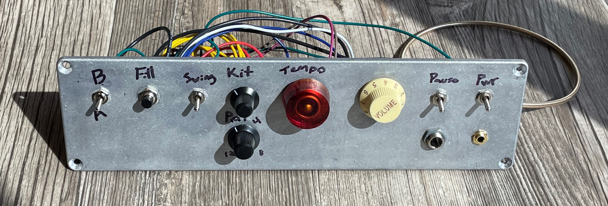
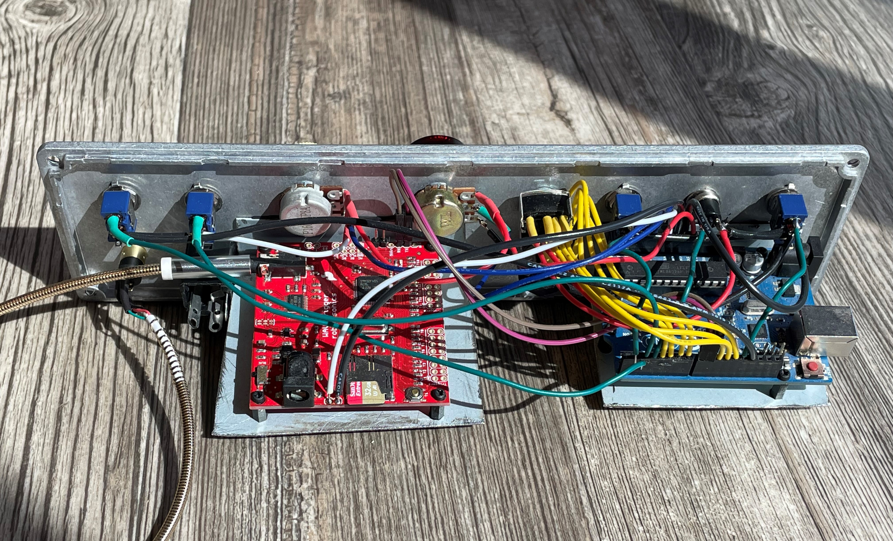

# DrummerBaby Drum Machine

The DrummerBaby uses a standard [Arduino](https://store.arduino.cc/products/arduino-uno-rev3s) and a [Wav Trigger](https://robertsonics.com/wav-trigger/) to create drum rhythms. Its a simpler version of the DrummerBoy that incorperates 32 preprogrammed beats, and three selectable drum sets.



## Replacing Sounds
Sound files must be:
- wav format
- 16 bit
- stereo

Sounds should be named starting with a 3-digit number (*XXX_examplesound.wav*), which is the reference used by our Arduino program. Remove the micro sd card and replace your desired sound. Make sure to use the same starting three-digit number as the sound you are replacing. The filename after the three digits is irrelevant to the program, keep it something descriptive of the sound. You don't need to change any filenames in the program itself.

```
void setSamples() {
  // SET 808 SAMPLES
  samples_808.hatclosed = 1;
  samples_808.hatopen = 2;
  samples_808.rim = 3;
  samples_808.shaker = 4;
  samples_808.cymbal = 5;

  samples_808.kick = 6;
  samples_808.snare = 7;
  samples_808.clap = 8;
  samples_808.cowbell = 9;

  samples_808.claves = 10;
  samples_808.congahigh = 11;
  samples_808.congamid = 12;
  samples_808.congalow = 13;
```
Above shows where samples are assigned for the first kit. This is around line 650 in the code. If you are replacing a sound, you won't need to change anything. If you want to add a sound and keep the other sound on the memory card, check the next available number in the samples naming, and name the new file according to the next index (currently 044). Then you can replace the old sample number with the new one in the *setSamples()* function for the desired kit. 

Importantly, samples do not need to represent the group you put them in. For example, 'claves' samples do not need to be claves. Here you could put any wild percussion sample, remember this when programming the patterns.

## Modifying patterns
Patterns use 16 beats per one bar (quarter notes). The first **0b** tells the program this variable is a binary literal. The next 16 0's and 1's define the pattern for each beat in the bar and for each sample type in the kit. Of course, 1's are on, and 0's are off. The order in which the patterns are defined is 1a, 1b, 2a, 2b, 3a, 3b...-> 16b.

```
const word hatclosed_p1 PROGMEM  = 0b1010100010101000;
const word hatopen_p1 PROGMEM    = 0b0000001000000010;
const word rim_p1 PROGMEM        = 0b0000100000001000;
const word shaker_p1 PROGMEM     = 0b0000000000000000;
const word cymbal_p1 PROGMEM     = 0b0000000000000000;
const word kick_p1 PROGMEM       = 0b1000000100000000;
const word snare_p1 PROGMEM      = 0b0000000000000000;
const word clap_p1 PROGMEM       = 0b0000000000000000;
const word cowbell_p1 PROGMEM    = 0b1001001000000000;
const word claves_p1 PROGMEM     = 0b0000000000000000;
const word congahigh_p1 PROGMEM  = 0b0000000000000100;
const word congamid_p1 PROGMEM   = 0b0000000000000010;
const word congalow_p1 PROGMEM   = 0b0000000000000001;
```

## Loading new code

Because this project was digital pin hungry, I had to use even the pins 0 and 1, which are usually left alone because they are the same pins that are used to program the Arduino. 

Before programming:
1. Remove the power adapter
2. Remove wires to pins 0 and 1
3. Insert the USB and program away

After Programming:
1. Unplug the USB
2. Re-plug pins 0 and 1
3. Connect the power adapter again

 **Debug Mode**: While programming, you can still run the machine, but you will lose functionality in the A/B selection and pausing switches. Turn debug mode on while programming and running the machine from the USB port. Make sure to turn debug mode back off afterward or else the two switch pins will be unresponsive. 

 **Adjusting swing**
 To adjust swing, just change line 946 to your target ratio.
 ```
     swingMS = tempoMS/3;
```

